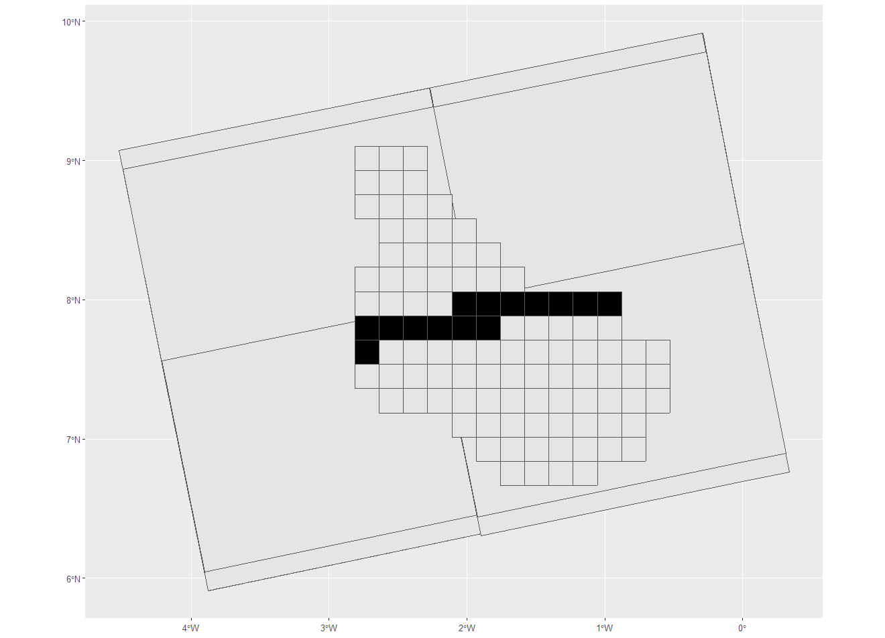
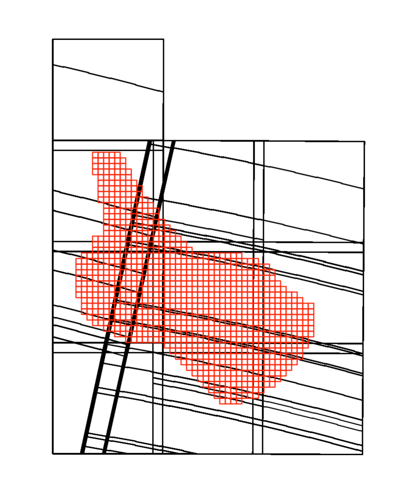

```{r setup, include=FALSE}
knitr::opts_chunk$set(echo = TRUE)
```

    Below is the image showing planet nicfi tiles(small) and Sentinel 1 tiles(big). Black tiles represent nicfi tiles intersecting with Sentinel1 images captured on the same day.

    Four bands (Blue, Green, Red, Near Infrared) from the planet scope imagery for the months of October and November will be used as variable in RF model.

    Performing Harmonic regression over the entire time series of Sentinel1 images will produce level3 data for sentinel1 with 2 images corresponding to each of nicfi tiles, one for VV polarization and one for VH polarization. Each image consists of six coefficients as a result of harmonic regression which will be used as variables for the RF model.


```{r, echo=FALSE, eval=TRUE, out.width="70%", fig.align="center"}

```

    Below is the image showing planet nicfi tiles(small) and Sentinel2 tiles(big)

    Performing wasp operation over the entire time series of Sentinel2 images will generate cloud free composites for two different seasons. Following bands from Sentinel2 for two seasons will be used as variables in RF model

    "B2","B3","B4","B8" "B5","B6","B7","B8A","B11","B12"

```{r, echo=FALSE, eval=TRUE, out.width="70%", fig.align="center"}

```

     mk_stack_en_2021 is the R script used to create raster stacks using 12 layers from sentinel 1 , 6 coefficients of harmonic for each of VV and VH, 20 layers from sentinel 2, 10 bands for each of season 1 and season 2 and 8 bands from planet scope, 4 bands for each of months October and November.

    The stacks used for this projects were already created before and were imported from aws s3 bucket for further analysis.

    sghana_field.geojson is the geojson with training polygons coming from class1 labels. maize.geojson is the geojson with training polygons for maize coming from class3 labels

    generate_dataset_en_2021.R is used to combine these two training datasets and then cropping the raster stacks to those training polygons generate training data for RF.The output of this step is a csv file with training data which will be used in next step.

    process_train_ref_set_y2_2021_en. R is used to process training data by calculating different indices using sentinel2 data which will be used as variable for RF.Data processing is done in this step to remove NA and infinite values.Weighted means is calculated for all the variables in the training dataset. Then, the dataset is divided into training and validation data and outputted as csv which will be used by the model in next step.

    rf_model_all_en.R is used to run the Random Forest model. The model is first run four times by randomly sampling from the training data maintaining the number of samples for each of the crops (maize,rice, other , non crop) to be of equal size by using different seed values 10,20,30 and 40.


    Variable Importance Plots for all the four models were observed and only the most important variables were filtered with a break point at mean decrease in accuracy greater than 0.01. Then, only the filtered variables which occurred in more than one plots of the four plots were used to run the random forest model again with reduced number of variables to improve accuracy.

    rf_prediction_en_2021.R is used to run predictions for tiles using the output generated by the RF model


