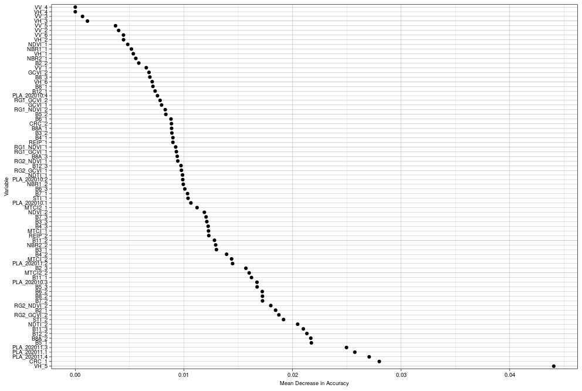
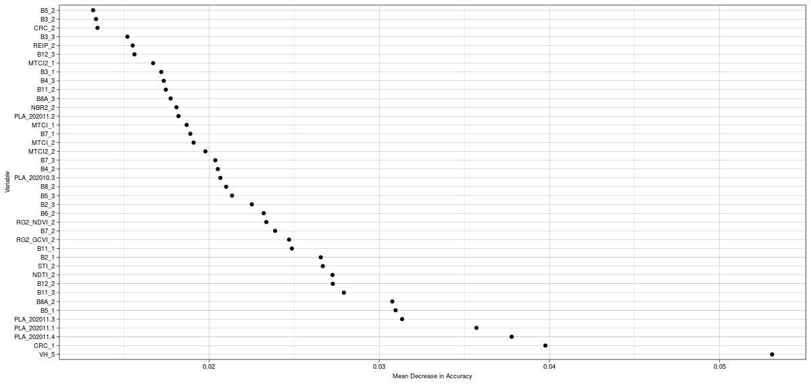
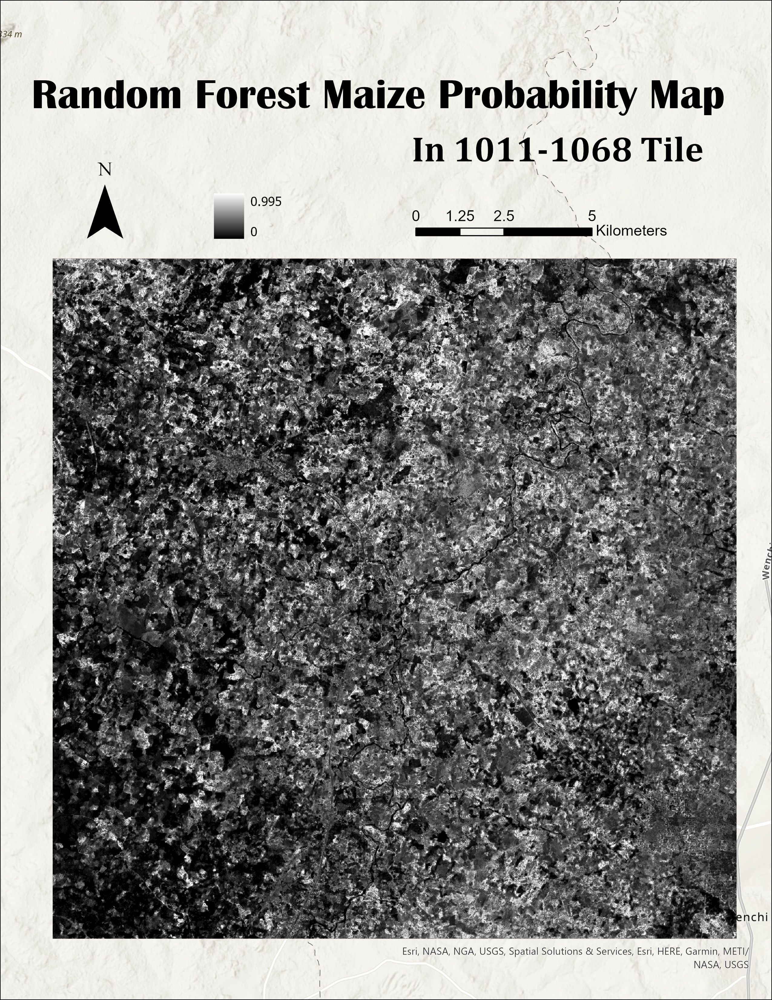
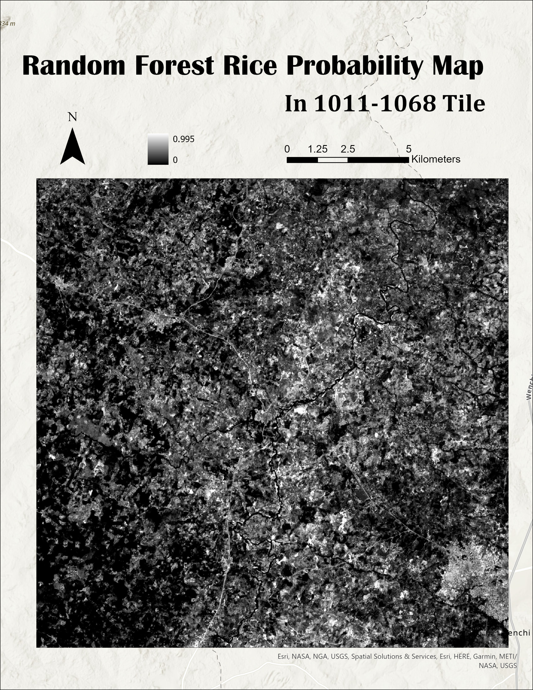
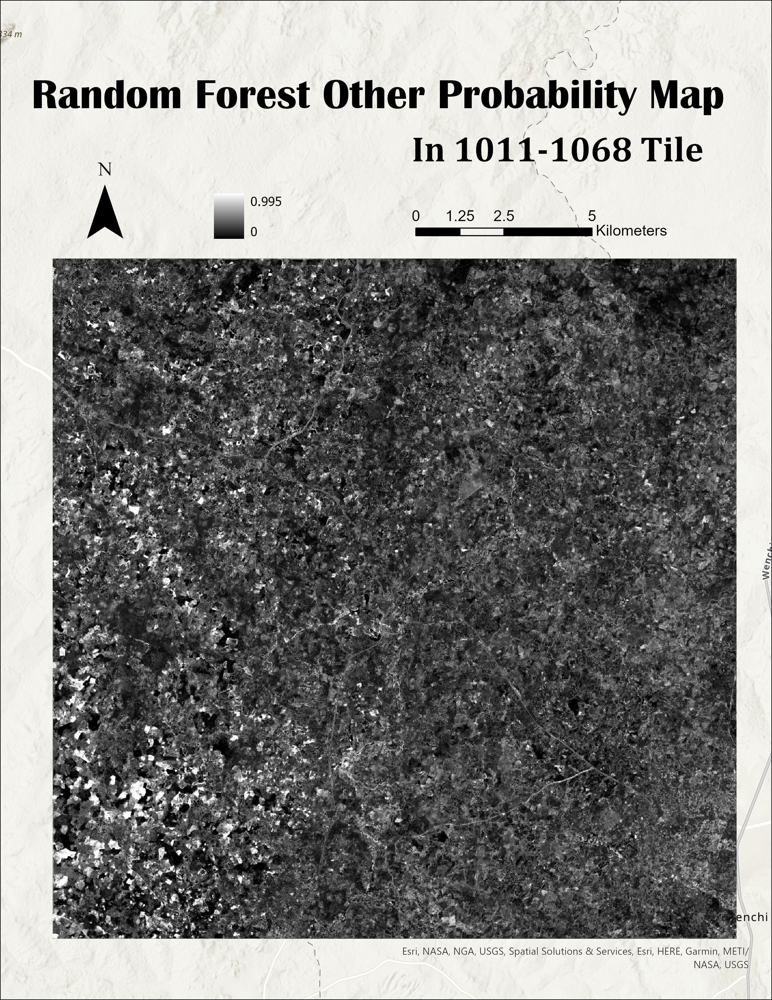

```{r setup, include=FALSE}
knitr::opts_chunk$set(echo = TRUE)
```

# Random Forest variable importance plots and accurary

     We use reference data set to train and test year 2 model and use ggplot to create Random Forest variable importance plots. Mean decrease accuracy is the measure of the performance of the model without each variable. A lower value indicates the less importance of that variable in predicting crop land type. Removal of that value causes the model to increase accuracy in prediction. 

    The accurary of the random forest model was measured using validation data and below are the results when all variables are included.

## for seed = 10, accuracy = 0.765
## for seed = 20, accuracy = 0.742
## for seed = 30, accuracy = 0.755
## for seed = 40, accuracy = 0.761

    Below is the Variable Importance plot with all the variables and is for the model that was run with seed set to 10 for random sampling.

```{r, echo=FALSE, eval=TRUE, out.width="70%", fig.align="center"}

```

    The accurary of the random forest model was measured using validation data and below are the results after reducing the number of variables by selecting only the important variables.

    The accurary of the new model was 0.755 and did not change by much.

    Below is the Variable Importance plot for the RF model after reducing the number of variables by identifying the variables that are having mean decrease in accurary greater than 0.01

```{r, echo=FALSE, eval=TRUE, out.width="70%", fig.align="center"}

```

    Top 10 important variables are VH_5, CRC_1, PLA_202011.4, PLA_202011.1, PLA202011.3, B5_1, B8A_2, B11_3, B12_2, NDTI_2.


# Crop type probability maps

    The following maps show the probability of crops (Maize, Rice, Other and Non-crop) in the tile 1011-1068. For example, in the Maize probability map, the probability values range from 0 to 0.984. The pixels with greater values are more likely to be Maize. In addition, the black area located in the northwestern part of the map has less probability of being Maize.


```{r, echo=FALSE, eval=TRUE, out.width="70%", fig.align="center"}

```

```{r, echo=FALSE, eval=TRUE, out.width="70%", fig.align="center"}

```

```{r, echo=FALSE, eval=TRUE, out.width="70%", fig.align="center"}

```

```{r, echo=FALSE, eval=TRUE, out.width="70%", fig.align="center"}
knitr::include_graphics("images/Non_Crop_1068.jpg")
```


